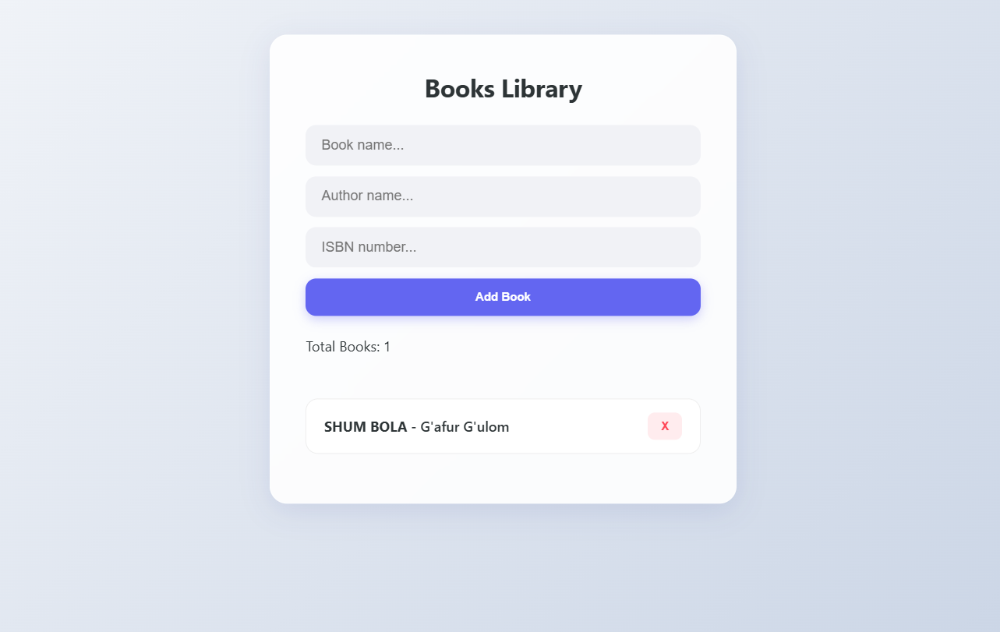

# 📚 Book Library System (OOP & SASS)

A professional, feature-rich Book Library application built using advanced **Object-Oriented Programming (OOP)** and **Modern SASS** methodology. This project demonstrates deep knowledge of JavaScript architecture and responsive web design (RWD).

---

## 📸 Project Preview


---

## 🚀 Key Upgrades & Features
- **Data Privacy:** Implemented **Private Class Fields (`#`)** to protect sensitive data like book prices.
- **Inheritance:** Uses a parent `Book` class and specialized `EBook` subclass to handle different book types.
- **Smart Logic:** Utilizes `instanceof` for type checking and dynamic UI styling.
- **Advanced SASS:** Built with a modular SCSS structure using **Mixins, Variables, and Nesting**.
- **Responsive Web Design (RWD):** Fully optimized for Mobile, Tablet, and Desktop views.
- **Live Statistics:** Real-time tracking of the total number of books.

## 🛠️ Tech Stack
- **JavaScript (ES6+):** OOP (Inheritance, Encapsulation, Static Methods).
- **SASS (SCSS):** Advanced styling with RWD Mixins.
- **HTML5:** Semantic and accessible structure.

---

## 🧠 Advanced Concepts Implemented

### 1. Encapsulation (Private Fields)
I used the `#price` private field to ensure that sensitive data cannot be accessed or modified directly from outside the class. Access is strictly controlled via **Getters**.


### 2. Class Inheritance
The project features a robust hierarchy where `EBook` extends `Book`. This allows for code reuse while adding specific properties like `format` (PDF/EPUB) and overriding parent methods.


### 3. Event Delegation & DOM Optimization
To ensure high performance, a single event listener is attached to the parent container. This handles actions for dynamically added books efficiently.

### 4. Responsive Design (SASS)
Using custom SASS Mixins, the UI adapts seamlessly to any screen size. The library list switches from a horizontal to a vertical layout on mobile devices for better UX.


---

## 📂 Installation & Usage
1. Clone the repository:
   ```bash
   git clone [https://github.com/Asilbek2706/Books-Library-JS.git](https://github.com/Asilbek2706/Books-Library-JS.git)

👨‍💻 Author <br>
<strong>Asilbek</strong> - Junior JavaScript Developer
